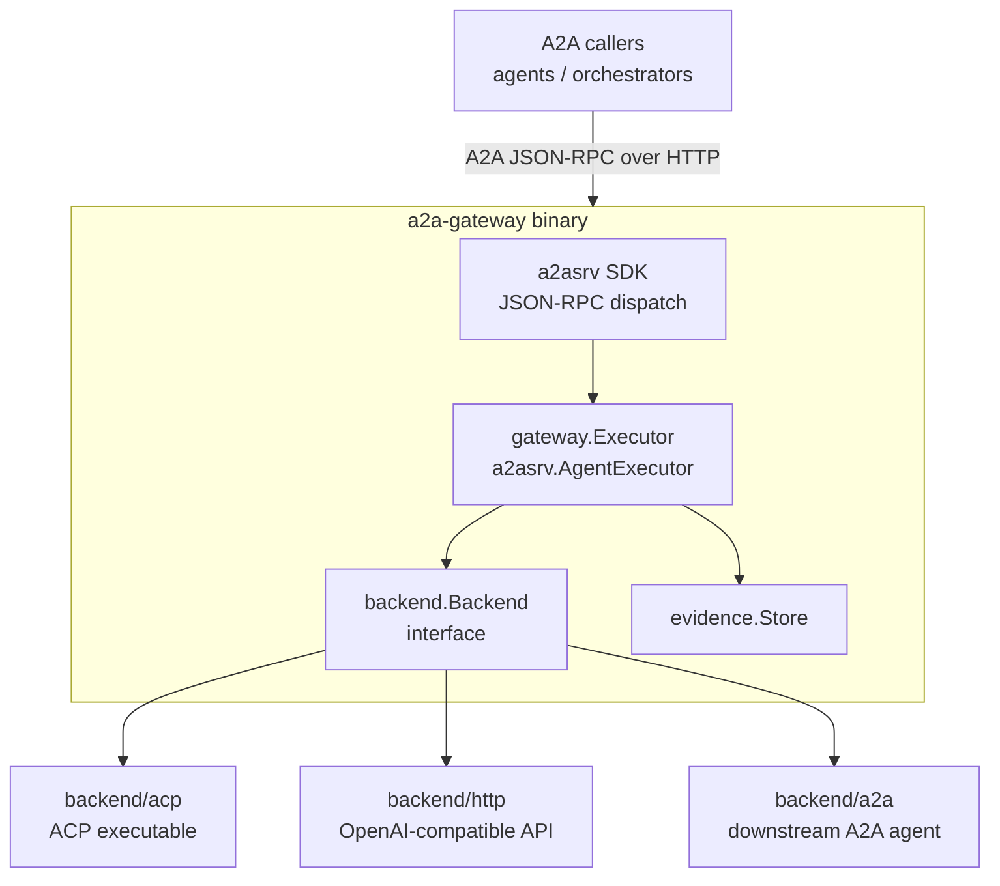
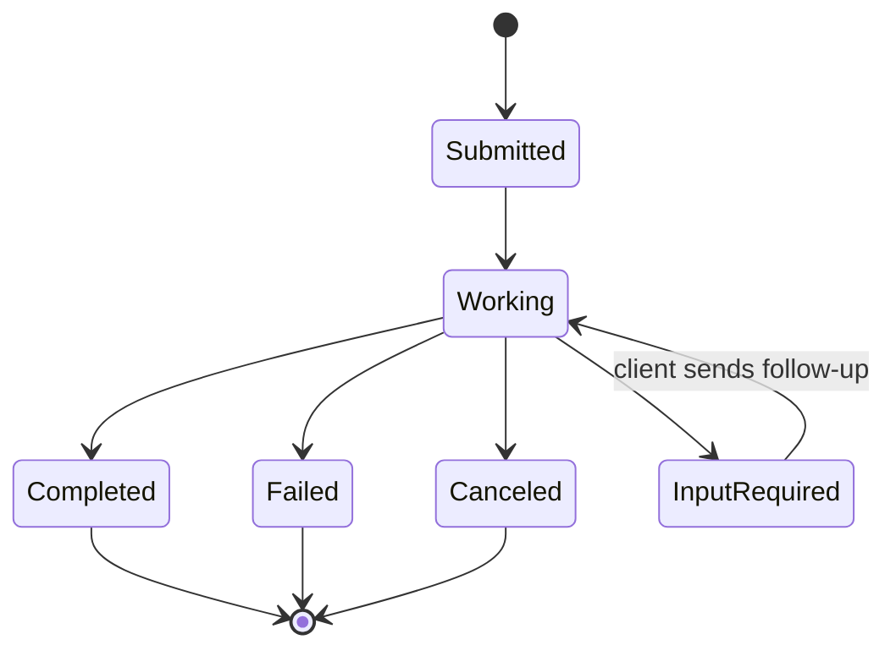

# Architecture

a2a-gateway is built on the `a2a-go/v2` SDK and follows a strict ports-and-adapters structure.

## High-level diagram



## Package map

```
a2a-gateway/
  cmd/a2a-gateway/        CLI entry point — subcommand dispatch
  internal/
    app/                  Composition root — wires all components
    config/               YAML load + validate
    gateway/              gateway.Executor (implements a2asrv.AgentExecutor)
                          gateway.Router   (skill-based routing)
                          gateway.ContentGuard (MIME-type filtering)
    backend/              backend.Backend interface (port — no logic)
    backend/acp/          ACP backend
    backend/http/         HTTP backend (OpenAI-compatible)
    backend/a2a/          A2A backend (gateway chaining)
    adapter/acp/          ACP protocol: JSON-RPC, stdio/TCP, process lifecycle
    evidence/             Per-task files + retention sweep
    push/                 SQLite push notification store + retry sender
    taskstore/            SQLite-backed A2A task store
    metrics/              Prometheus metric definitions
    logger/               Structured logger (go.uber.org/zap)
    telemetry/            OpenTelemetry OTLP setup
```

## The SDK does the protocol heavy lifting

The `a2a-go/v2` SDK's `a2asrv.NewJSONRPCHandler` handles all A2A JSON-RPC dispatch:

- `SendMessage` / `SendStreamingMessage`
- `GetTask` / `ListTasks` / `CancelTask` / `SubscribeToTask`
- Push notification CRUD
- `GetExtendedAgentCard`

The gateway contributes one thing: a concrete `a2asrv.AgentExecutor` implementation (`gateway.Executor`) that the SDK calls to actually execute a task.

## gateway.Executor

`gateway.Executor` implements `a2asrv.AgentExecutor`:

```go
func (e *Executor) Execute(
    ctx context.Context,
    execCtx *a2asrv.ExecutorContext,
) iter.Seq2[a2a.Event, error]
```

It:
1. Emits a `TaskSubmitted` status event
2. Emits a `TaskWorking` status event
3. Calls `backend.Backend.Execute(ctx, taskID, history, msg)` and forwards all events
4. Emits `TaskCompleted` or `TaskFailed` on completion
5. Writes evidence concurrently with task execution

## backend.Backend interface

```go
type Backend interface {
    Execute(
        ctx context.Context,
        taskID string,
        history []*a2a.Message,
        msg *a2a.Message,
    ) iter.Seq2[a2a.Event, error]
}
```

Three concrete implementations: `backend/acp`, `backend/http`, `backend/a2a`.

## Package import rules

These are enforced by `make check-boundaries` and the `boundary-check` CI job.

| Package | May import | Must NOT import |
|---|---|---|
| `adapter/acp` | **stdlib only** | Any `internal/` package |
| `backend` (port) | `a2a-go/v2/a2a`, stdlib | Any implementation package |
| `backend/acp` | `backend`, `adapter/acp` | `gateway`, `app` |
| `backend/http` | `backend`, stdlib, `a2a-go/v2` | `gateway`, `adapter/acp` |
| `backend/a2a` | `backend`, `a2aclient` (SDK) | `gateway`, `adapter/acp` |
| `gateway` | `backend`, `evidence`, `a2asrv` | `adapter/acp`, `backend/acp` |
| `app` | Everything | (composition root — may import all) |

The critical rule: **`gateway` must never directly import `adapter/acp` or `backend/acp`**. It depends only on the `backend.Backend` interface.

## Task lifecycle



All state transitions are emitted as `a2a.TaskStatusUpdateEvent` values.
Artifacts (text chunks, files) are emitted as `a2a.TaskArtifactUpdateEvent` values.
The SDK's task store records every state change.

## Composition root

`internal/app` is the only package that knows about all concrete types. It wires everything together:

```
app.RunServe
  ├── config.Load(path)
  ├── logger.NewWithLevel(level)
  ├── telemetry.Init(cfg)
  ├── evidence.NewFilesystemStore(dir)
  ├── taskstore.NewSQLite(path)     or in-memory SDK store
  ├── push.NewSQLiteStore(path)     or push.NewInMemoryStore()
  ├── backend.Build(cfg)            → backend/acp | backend/http | backend/a2a
  ├── gateway.New(cfg, backend, evidenceStore)
  ├── app.buildAgentCard(cfg)
  └── a2asrv.NewJSONRPCHandler(executor, ...)
```

## Horizontal scaling

Multiple replicas can share the same SQLite file (`task.store_path`). SQLite WAL mode allows concurrent readers and a single writer. Push notification configs and permission pause states are stored in the same shared file cluster, so any replica can serve any request.

See [Deployment](./deployment.md) for details.
