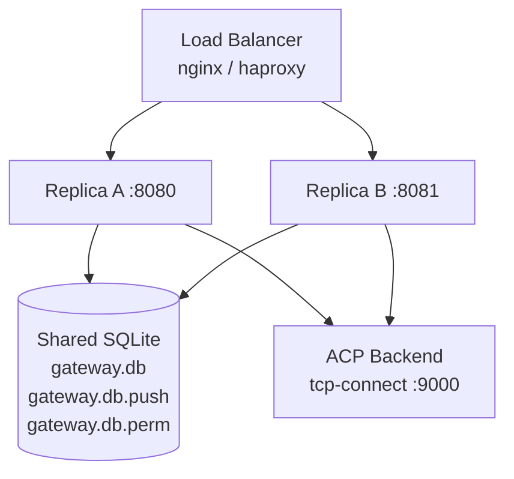

# Deployment

## Single instance

Start the gateway with a config file:

```bash
./bin/a2a-gateway serve --config /etc/a2a-gateway/gateway.yaml
```

Or using the agent shorthand (loads `agents/<name>.yaml`):

```bash
./bin/a2a-gateway serve --agent gateway-a
```

### Recommended single-instance config

```yaml
gateway:
  id: "prod-gateway"
  listen_addr: "127.0.0.1:8081"
  evidence_dir: "/data/evidence"
  evidence_retention:
    max_age: "30d"
    max_size_mb: 2048
    check_interval: "1h"

a2a:
  public_url: "https://my-gateway.example.com"
  auth:
    mode: "bearer"
    bearer_token_env: "A2A_GATEWAY_TOKEN"

backend:
  type: "acp"
  acp:
    transport: "tcp-connect"
    tcp:
      host: "127.0.0.1"
      port: 9000

task:
  store_path: "/data/gateway.db"
  timeout: "5m"

metrics:
  enabled: true
  addr: "127.0.0.1:9090"

log:
  level: "info"
```

### As a systemd service (Linux)

```ini
[Unit]
Description=a2a-gateway
After=network.target

[Service]
Type=simple
User=gateway
ExecStart=/usr/local/bin/a2a-gateway serve --config /etc/a2a-gateway/gateway.yaml
Restart=on-failure
RestartSec=5s
Environment=A2A_GATEWAY_TOKEN=<set-this>
Environment=LOG_LEVEL=info

[Install]
WantedBy=multi-user.target
```

---

## Multi-replica (horizontal scaling)

Multiple replicas can share the same SQLite database files.



### Requirements

- All replicas share the same filesystem path (local disk, or NFS)
- ACP backend uses `tcp-connect` or `tcp-spawn` — not `stdio-spawn` (which spawns one process per replica)
- All replicas use the same config file

### Multi-replica config

```yaml
gateway:
  id: "gateway-cluster"
  listen_addr: "0.0.0.0:8080"
  evidence_dir: "/data/evidence"

a2a:
  public_url: "https://gateway.example.com"
  auth:
    mode: "bearer"
    bearer_token_env: "A2A_GATEWAY_TOKEN"

backend:
  type: "acp"
  acp:
    transport: "tcp-connect"
    tcp:
      host: "127.0.0.1"
      port: 9000
      startup_timeout: "10s"

task:
  store_path: "/data/gateway.db"
  timeout: "5m"
```

When `store_path` is set, the gateway creates:

| File | Contents |
|---|---|
| `/data/gateway.db` | A2A task state |
| `/data/gateway.db.push` | Push notification webhook registrations |
| `/data/gateway.db.perm` | ACP permission pause states |

All three files use **SQLite WAL mode** with a 5-second busy timeout.

### Starting multiple replicas

```bash
# Replica A on port 8080
A2A_GATEWAY_TOKEN=secret ./bin/a2a-gateway serve --config gateway.yaml &

# Replica B on port 8081 (same config)
A2A_GATEWAY_TOKEN=secret ./bin/a2a-gateway serve --config gateway.yaml &
```

The load balancer routes A2A requests to either replica. Push notification webhooks registered on replica A are visible to replica B (shared SQLite).

### Behaviour guarantees

| Scenario | Result |
|---|---|
| Client registers webhook on replica A, task completes on replica B | Webhook is called (push config in shared SQLite) |
| Client sends `GetTask` to a different replica than where it was submitted | Task is found (shared task store) |
| Two replicas start simultaneously | Both apply schema migrations safely (`IF NOT EXISTS` guards) |
| Permission pause recorded on replica A, follow-up lands on replica B | Permission is resolved (shared perm store) |

---

## Behind a reverse proxy

Example nginx config for TLS termination:

```nginx
server {
    listen 443 ssl;
    server_name gateway.example.com;

    ssl_certificate     /certs/fullchain.pem;
    ssl_certificate_key /certs/privkey.pem;
    ssl_protocols       TLSv1.2 TLSv1.3;

    location / {
        proxy_pass         http://127.0.0.1:8081;
        proxy_set_header   Host $host;
        proxy_set_header   X-Real-IP $remote_addr;
        proxy_buffering    off;           # required for SSE streaming
        proxy_read_timeout 300s;          # long timeout for streaming tasks
        proxy_send_timeout 300s;
    }
}
```

**`proxy_buffering off` is required for SSE streaming to work correctly.**

---

## Hot reload

Send `SIGHUP` to the running process to reload config:

```bash
kill -HUP $(pgrep a2a-gateway)
```

Reloads without restart:
- `log.level`
- `gateway.rate_limit`

Requires restart:
- Backend config changes
- `listen_addr` changes
- Auth mode or token changes

---

## No Docker/Kubernetes support

There is no official Dockerfile or Kubernetes manifests at this time. See [Future Work](./faq.md#is-there-a-docker-image) for status. Building a minimal container image is straightforward — compile the binary and copy it into a `gcr.io/distroless/static` or `alpine` image.
